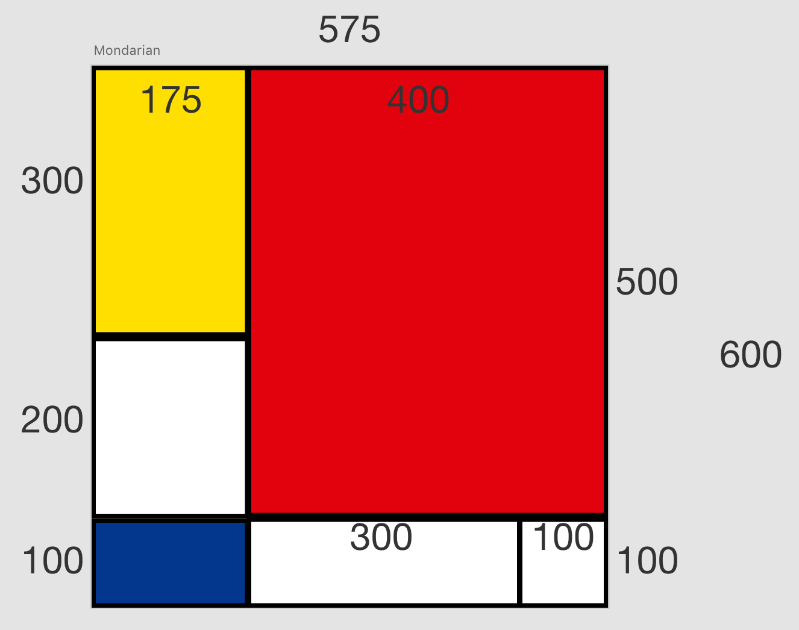

#### Mondrian Layout with CSS Grid 

### DCI project 
### Exercise practicing  CSS Grid Layout 

The grid layout resembles the work of Dutch artist Piet Mondrian whose later art was limited to the three primary colors (red, blue and yellow),the three primary values (black, white and gray), and the two primary directions (horizontal and vertical). 

Mondrian's early works consisted largely of beautiful landscapes.

 CSS grid is used to place a few of Mondrian's early landscapes along responsive right angles like his later art while utilizing exciting features of the CSS grid like `grid-auto-flow`. 
 
 Placement and sizes are generated randomly on-refreshing the page.

 Sample Dimensions of each section

